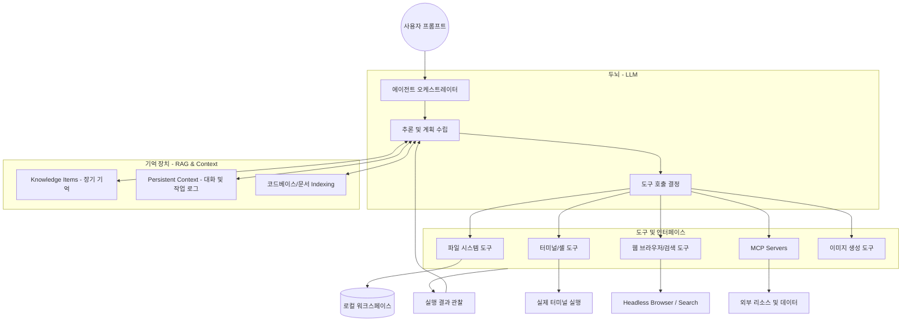
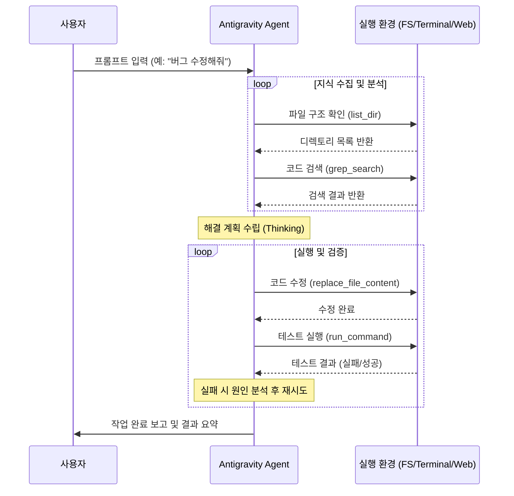

# Antigravity 시스템 아키텍처 및 동작 원리 가이드

이 문서는 Antigravity AI 에이전트의 내부 구조, 도구 연동 방식, 그리고 지식 관리 시스템에 대해 상세히 설명합니다.

---

## 1. 전체 시스템 아키텍처

Antigravity는 단순한 LLM을 넘어선 **자율적 에이전트 시스템**입니다. LLM이 '두뇌' 역할을 하며, 다양한 도구(Tools)와 MCP(Model Context Protocol)를 통해 실제 환경(파일 시스템, 터미널, 웹)과 상호작용합니다.

---

## 2. 핵심 동작 원리: Reasoning Loop (Think-Act-Observe)

Antigravity는 사용자 요청을 완수할 때까지 다음 루프를 반복합니다.

1.  **Think (추론)**: 요청을 분석하고, 현재 상태를 파악하며, 다음 단계(Step)를 계획합니다.
2.  **Act (실행)**: 계획된 행동을 위해 가장 적합한 도구를 선택하여 실행합니다.
3.  **Observe (관찰)**: 도구 실행의 결과(성공/실패, 출력 내용, 오류 메시지)를 분석하여 지식으로 흡수합니다.

---

## 3. 주요 구성 요소 상세 설명

### 3.1 LLM & Orchestration
*   **지능**: 고성능 LLM을 사용하여 복잡한 코딩 문제 해결 및 아키텍처 설계를 수행합니다.
*   **Sub-agents**: 복잡도가 높은 작업(예: 브라우저 조작)은 전용 Sub-agent에게 위임하여 전문성을 높입니다.

### 3.2 도구 생태계 (Toolbox)
*   **파일 시스템(FS)**: 코드를 읽고(`view_file`), 구조를 파악하고(`view_file_outline`), 정밀하게 수정(`multi_replace_file_content`)합니다.
*   **터미널**: 실제 셸 명령어를 실행하여 빌드, 테스트, 배포 과정을 수행합니다.
*   **MCP (Model Context Protocol)**: 다양한 외부 서비스(GitHub, Google Drive, Slack 등)와 표준화된 방식으로 연동하여 리소스를 가져옵니다.

### 3.3 지식 관리 (Memory System)
*   **RAG (Retrieval-Augmented Generation)**: 단순히 문서를 찾는 수준을 넘어, 프로젝트의 전반적인 맥락을 실시간으로 검색하여 LLM의 context window를 최적화합니다.
*   **Knowledge Items (KIs)**: 과거의 중요한 결정 사항, 아키텍처 패턴, 해결된 버그 등을 데이터베이스화하여 동일한 실수를 반복하지 않도록 합니다.

### 3.4 워크플로우 (Workflows)
*   프로젝트 루트의 `.agents/workflows`에 정의된 가이드를 읽어, 복잡한 프로세스를 표준화된 절차에 따라 수행합니다.

---

## 4. LangGraph 및 기술 스택 활용 방식

*   **상태 관리**: 작업의 진행 상태를 그래프 구조로 관리하여, 어느 단계에서 오류가 발생했는지 추적하고 복구할 수 있습니다.
*   **에이전트 협업**: 상위 에이전트가 전략을 짜고, 하위 실행 유닛들이 각자의 도구를 사용하여 결과를 보고하는 계층적 구조를 가집니다.

---

*본 문서는 Antigravity 에이전트에 의해 자동 생성되었습니다.*
