# OpenClaw Agent 동작 원리 및 쿼리 처리 플로우

## 목차

1. [개요](#개요)
2. [전체 시퀀스 다이어그램](#전체-시퀀스-다이어그램)
3. [단계별 상세 설명](#단계별-상세-설명)
4. [Agentic Loop 상세](#agentic-loop-상세)
5. [시스템 프롬프트 구성](#시스템-프롬프트-구성)
6. [도구(Tool) 실행 파이프라인](#도구tool-실행-파이프라인)
7. [세션 및 컨텍스트 관리](#세션-및-컨텍스트-관리)
8. [에러 처리 및 Failover](#에러-처리-및-failover)
9. [핵심 파일 참조](#핵심-파일-참조)

---

## 개요

OpenClaw Agent는 사용자의 쿼리(메시지)를 받아 LLM(대형 언어 모델)과 도구 실행을 반복하며 작업을 수행하는 **Agentic AI 시스템**이다.

핵심 동작 원리:

1. **사용자 입력** → CLI, 웹, 메시징 채널(Telegram, Discord, Slack 등)을 통해 수신
2. **게이트웨이 라우팅** → 메시지를 적절한 에이전트 세션으로 라우팅
3. **시스템 프롬프트 구성** → 에이전트 정체성, 도구, 스킬, 컨텍스트 조합
4. **LLM 호출** → 스트리밍으로 응답 생성
5. **도구 실행 루프** → LLM이 도구 사용을 요청하면 실행 후 결과를 다시 LLM에 전달
6. **응답 전달** → 최종 응답을 원래 채널로 전송

---

## 전체 시퀀스 다이어그램

### 1. End-to-End 쿼리 처리 흐름

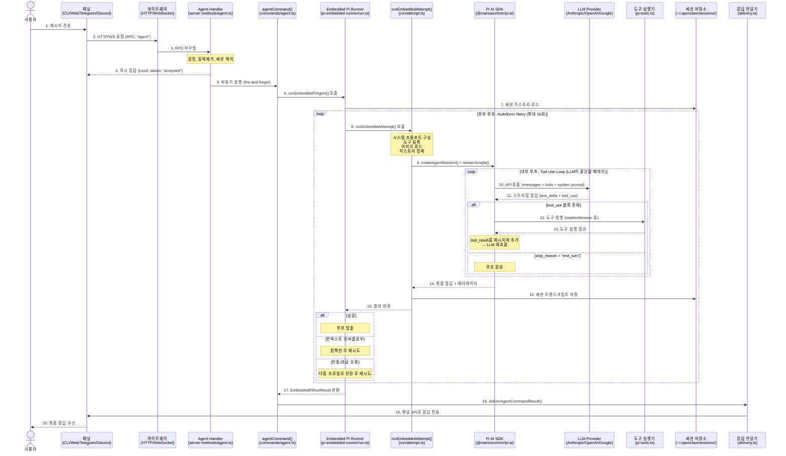

### 2. 게이트웨이 내부 처리 흐름

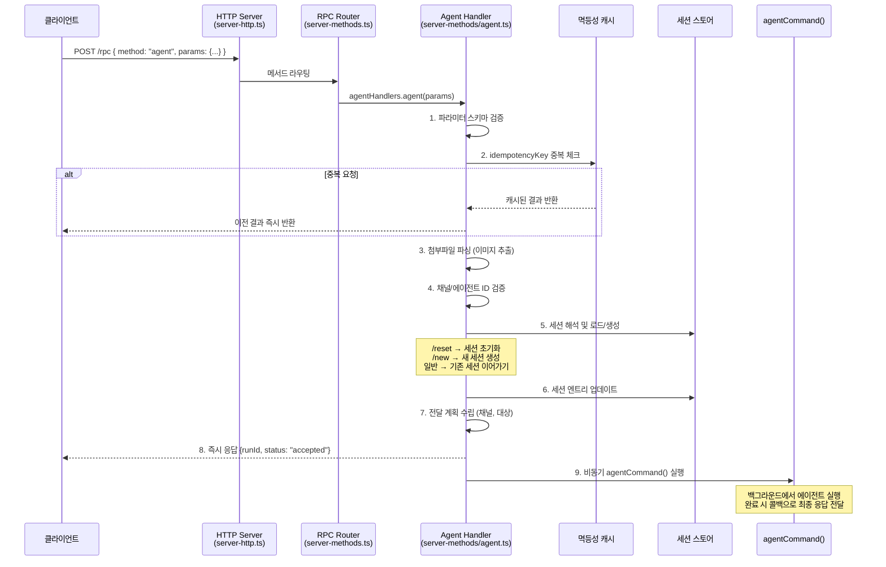

### 3. Agentic Tool-Use Loop 상세

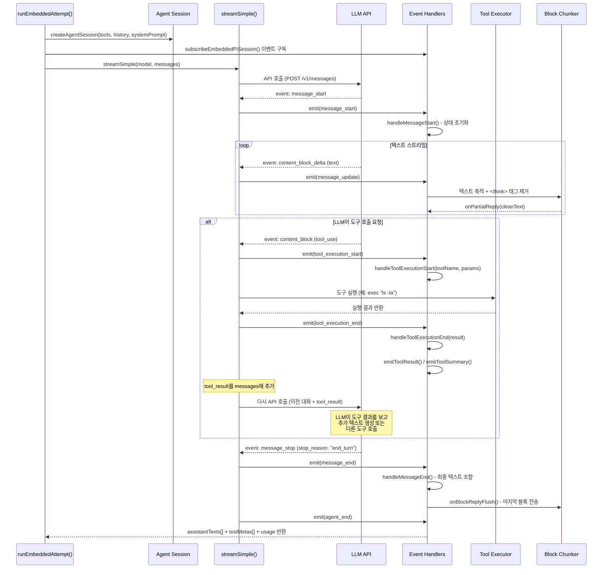

### 4. 채널별 메시지 수신 흐름

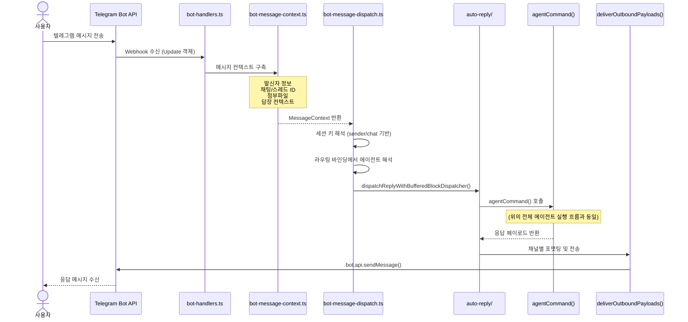

---

## 단계별 상세 설명

### Phase 1: 사용자 입력 수신

| 단계 | 설명 | 핵심 파일 |
|------|------|----------|
| **1-1** | 사용자가 CLI, 웹, 또는 메시징 채널을 통해 메시지 전송 | `src/entry.ts` |
| **1-2** | CLI의 경우 Commander로 인자 파싱 후 `agentCliCommand()` 호출 | `src/cli/program/register.agent.ts` |
| **1-3** | 채널의 경우 Webhook/WebSocket으로 게이트웨이에 도달 | `src/telegram/bot-handlers.ts` 등 |

**CLI 진입 경로:**
```
openclaw agent --message "코드 리뷰해줘" --local
  → entry.ts → run-main.ts → buildProgram() → register.agent.ts
  → agentCliCommand(opts)
    → --local이면 agentCommand() 직접 호출
    → 아니면 callGateway()로 게이트웨이 경유
```

**채널 진입 경로:**
```
텔레그램 메시지 수신
  → bot-handlers.ts (Webhook)
  → bot-message-context.ts (컨텍스트 구축)
  → bot-message-dispatch.ts (세션/에이전트 해석)
  → auto-reply/ (에이전트 실행 트리거)
```

---

### Phase 2: 게이트웨이 라우팅

| 단계 | 설명 | 핵심 파일 |
|------|------|----------|
| **2-1** | HTTP/WebSocket 요청 수신 및 인증 확인 | `src/gateway/server-http.ts` |
| **2-2** | RPC 메서드(`"agent"`)에 따라 핸들러 라우팅 | `src/gateway/server-methods.ts` |
| **2-3** | `idempotencyKey`로 중복 요청 필터링 | `server-methods/agent.ts` |
| **2-4** | 세션 키 해석 → 기존 세션 로드 또는 새로 생성 | `server-methods/agent.ts` |
| **2-5** | 즉시 `{runId, status: "accepted"}` 응답 → 비동기 실행 | `server-methods/agent.ts` |

**RPC 요청 파라미터:**
```typescript
{
  message: string           // 사용자 입력 텍스트
  idempotencyKey: string    // 중복 방지 키
  sessionKey?: string       // 세션 식별 (예: "agent@telegram:12345")
  agentId?: string          // 특정 에이전트 지정
  thinking?: string         // 추론 레벨 ("off"|"low"|"medium"|"high")
  deliver?: boolean         // 채널로 응답 전달 여부
  channel?: string          // 전달 채널 (telegram|discord|slack 등)
  attachments?: Array       // 첨부 파일 (이미지 등)
  timeout?: number          // 타임아웃 (초)
}
```

---

### Phase 3: 에이전트 세션 준비

| 단계 | 설명 | 핵심 파일 |
|------|------|----------|
| **3-1** | 설정 로드 및 워크스페이스/에이전트 ID 해석 | `src/commands/agent.ts` |
| **3-2** | 모델/프로바이더 해석 (Anthropic, OpenAI, Google 등) | `pi-embedded-runner/model.ts` |
| **3-3** | 세션 매니저 오픈 (디스크에서 대화 기록 로드) | `run/attempt.ts:585` |
| **3-4** | 히스토리 정제 (유효성 검사, 고아 tool_result 정리, 턴 수 제한) | `run/attempt.ts:810-841` |
| **3-5** | 시스템 프롬프트 구성 (정체성 + 도구 + 스킬 + 컨텍스트) | `src/agents/system-prompt.ts` |
| **3-6** | 도구 목록 생성 및 등록 | `src/agents/pi-tools.ts` |
| **3-7** | 프롬프트 내 이미지 탐지 및 로드 | `run/images.ts` |

---

### Phase 4: LLM 호출 및 Agentic Loop

| 단계 | 설명 | 핵심 파일 |
|------|------|----------|
| **4-1** | `createAgentSession()`으로 Pi SDK 에이전트 인스턴스 생성 | `run/attempt.ts:671` |
| **4-2** | `streamSimple()`로 LLM API 스트리밍 호출 | `@mariozechner/pi-ai` |
| **4-3** | LLM 응답에서 `text_delta` → 사용자에게 스트리밍 | `pi-embedded-subscribe.ts` |
| **4-4** | `tool_use` 블록 감지 → 도구 실행 → `tool_result` 추가 | SDK 내부 루프 |
| **4-5** | `stop_reason === "end_turn"`까지 4-2~4-4 반복 | SDK 내부 루프 |
| **4-6** | 최종 텍스트 조합 및 세션에 저장 | `run/attempt.ts` |

**LLM API 호출 페이로드:**
```typescript
{
  model: "claude-opus-4-6",       // 설정된 모델
  system: "시스템 프롬프트 전문",     // buildAgentSystemPrompt() 결과
  messages: [                      // 대화 히스토리 + 현재 메시지
    { role: "user", content: "이전 질문" },
    { role: "assistant", content: "이전 답변" },
    { role: "user", content: "현재 질문" }
  ],
  tools: [                         // 사용 가능한 도구 목록
    { name: "exec", description: "...", input_schema: {...} },
    { name: "read", description: "...", input_schema: {...} },
    // ...
  ],
  stream: true,
  max_tokens: 8192
}
```

---

### Phase 5: 응답 스트리밍 및 처리

| 단계 | 설명 | 핵심 파일 |
|------|------|----------|
| **5-1** | `subscribeEmbeddedPiSession()`으로 이벤트 핸들러 등록 | `pi-embedded-subscribe.ts:34` |
| **5-2** | `message_start` → 상태 초기화 | `handlers.messages.ts` |
| **5-3** | `message_update` → 텍스트 청크 축적, `<think>` 태그 제거 | `handlers.messages.ts` |
| **5-4** | `onPartialReply()` → 실시간 스트리밍 출력 (웹/CLI) | `pi-embedded-subscribe.ts` |
| **5-5** | `onBlockReply()` → 단락 단위 소프트 청킹 (메시징 채널) | `EmbeddedBlockChunker` |
| **5-6** | `message_end` → 최종 텍스트 확정 및 블록 플러시 | `handlers.messages.ts` |

**이벤트 핸들러 매핑:**
```
SDK Event                    → Handler Function
─────────────────────────────────────────────────
message_start               → handleMessageStart()
message_update (text)       → handleMessageUpdate()
message_end                 → handleMessageEnd()
tool_execution_start        → handleToolExecutionStart()
tool_execution_update       → handleToolExecutionUpdate()
tool_execution_end          → handleToolExecutionEnd()
agent_start                 → handleAgentStart()
auto_compaction_start/end   → handleAutoCompaction*()
agent_end                   → handleAgentEnd()
```

---

### Phase 6: 응답 전달

| 단계 | 설명 | 핵심 파일 |
|------|------|----------|
| **6-1** | `buildEmbeddedRunPayloads()`로 최종 페이로드 조합 | `run/payloads.ts` |
| **6-2** | `deliverAgentCommandResult()`로 전달 계획 실행 | `commands/agent/delivery.ts` |
| **6-3** | `deliverOutboundPayloads()`로 채널별 포맷 변환 및 전송 | `src/infra/outbound/deliver.ts` |
| **6-4** | 채널 API 호출 (Telegram `sendMessage`, Discord `send` 등) | 각 채널 모듈 |

**채널별 전달 방식:**
| 채널 | 포맷 | API |
|------|------|-----|
| Telegram | HTML | `bot.api.sendMessage()` |
| Discord | Markdown | `client.channels.cache.get().send()` |
| Slack | mrkdwn | `client.chat.postMessage()` |
| Web | Markdown (스트리밍) | WebSocket delta |
| Signal | Plain text | Signal CLI |
| iMessage | Plain text | Mac app bridge |

---

## Agentic Loop 상세

### 이중 루프 구조

OpenClaw Agent는 **이중 루프(Dual Loop)** 구조로 동작한다:

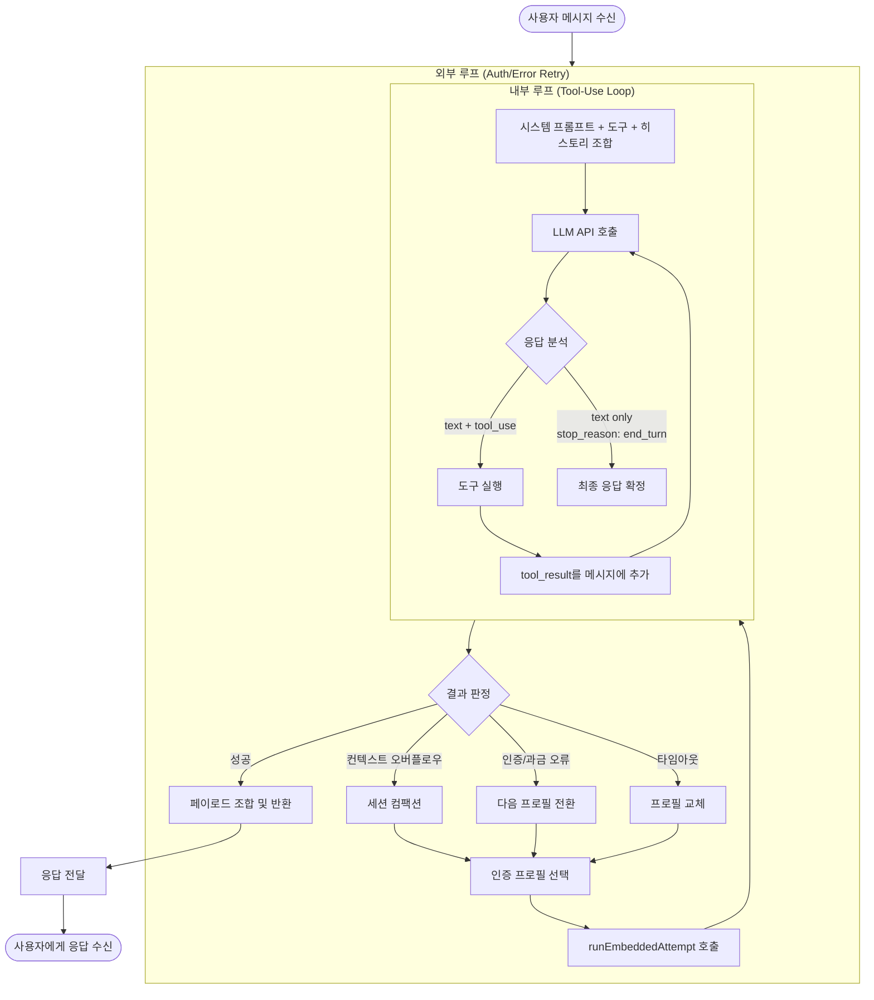

### 외부 루프 (run.ts, line 533-1153)

- **목적:** 인증 프로필 로테이션, 에러 복구, 컨텍스트 오버플로우 처리
- **최대 반복:** `MAX_RUN_LOOP_ITERATIONS = 10`
- **중단 조건:** 성공 또는 복구 불가능한 에러

```
while (true) {
  1. 반복 횟수 체크 (최대 10회)
  2. runEmbeddedAttempt() 호출
  3. 결과 판정:
     - 성공 → 페이로드 구성 후 반환
     - 컨텍스트 오버플로우 → compactEmbeddedPiSession() 후 재시도
     - 인증 오류 → 다음 auth profile로 전환 후 재시도
     - 과금 오류 → 프로필 전환 후 재시도
     - 레이트 리밋 → 쿨다운 후 재시도
     - 기타 오류 → 에러 응답 반환
}
```

### 내부 루프 (SDK의 streamSimple 내부)

- **목적:** LLM과 도구 실행의 반복적 상호작용
- **중단 조건:** LLM의 `stop_reason`이 `"tool_use"`가 아닌 경우 (예: `"end_turn"`)

```
loop {
  1. LLM API 호출 (대화 히스토리 + 시스템 프롬프트 + 도구 정의)
  2. 스트리밍 응답 수신 (text_delta 이벤트)
  3. tool_use 블록이 있으면:
     a. 도구 실행 (read, write, exec 등)
     b. 실행 결과를 tool_result 메시지로 추가
     c. 루프 계속 (LLM에 결과 전달)
  4. stop_reason이 "end_turn"이면 루프 종료
}
```

---

## 시스템 프롬프트 구성

시스템 프롬프트는 에이전트가 LLM에 보내는 **첫 번째 지시사항**이다. 에이전트의 정체성, 사용 가능한 도구, 안전 규칙, 워크스페이스 컨텍스트 등을 하나의 텍스트로 조합한다.

### 프롬프트 구성 전체 흐름

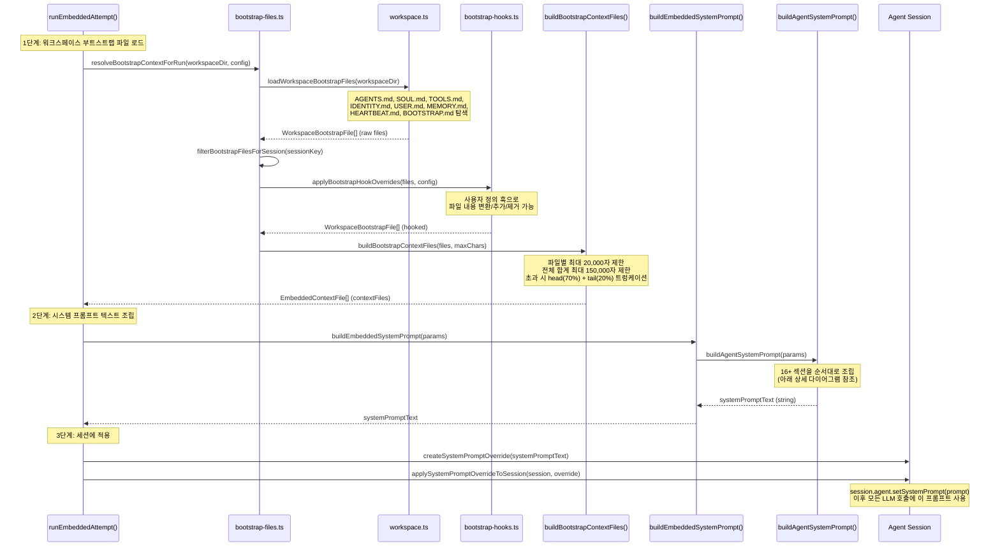

### 프롬프트 섹션 조립 순서

`buildAgentSystemPrompt()` (`src/agents/system-prompt.ts:196`)에서 아래 섹션들을 **순서대로** 조합한다:

```mermaid
flowchart TD
    Start["You are a personal assistant running inside OpenClaw."] --> S1

    subgraph Core["핵심 섹션 (항상 포함)"]
        S1["## Tooling<br/>사용 가능한 도구 목록 + 설명<br/><i>read, write, edit, exec, grep, find, ...</i>"]
        S2["## Tool Call Style<br/>도구 호출 시 설명 여부 규칙"]
        S3["## Safety<br/>안전 규칙 (자기보존 금지, 감독 우선 등)"]
    end

    subgraph Full["Full 모드 전용 섹션"]
        S4["## OpenClaw CLI Quick Reference<br/>CLI 명령어 가이드"]
        S5["## Skills (mandatory)<br/>사용 가능한 스킬 목록 + 선택 규칙"]
        S6["## Memory Recall<br/>메모리 검색/인출 지침"]
        S7["## OpenClaw Self-Update<br/>자가 업데이트 규칙"]
        S8["## Model Aliases<br/>모델 별칭 목록"]
        S9["## Documentation<br/>문서 경로 + 커뮤니티 링크"]
    end

    subgraph Context["컨텍스트 섹션"]
        S10["## Workspace<br/>작업 디렉토리 경로 + 안내"]
        S11["## Sandbox<br/>(샌드박스 활성 시) 컨테이너 경로 + 제약"]
        S12["## Authorized Senders<br/>허용된 발신자 목록"]
        S13["## Current Date & Time<br/>타임존 정보"]
    end

    subgraph Channel["채널/메시징 섹션"]
        S14["## Workspace Files (injected)<br/>프로젝트 컨텍스트 파일 안내"]
        S15["## Reply Tags<br/>[[reply_to_current]] 등 답장 태그 문법"]
        S16["## Messaging<br/>세션 간 메시징, 서브에이전트, message 도구 사용법"]
        S17["## Voice (TTS)<br/>음성 합성 힌트 (설정 시)"]
    end

    subgraph Extra["추가 섹션"]
        S18["## Group Chat Context / Subagent Context<br/>extraSystemPrompt (사용자 지정 추가 프롬프트)"]
        S19["## Reactions<br/>리액션 가이드 (minimal/extensive)"]
        S20["## Reasoning Format<br/>&lt;think&gt;...&lt;/think&gt; + &lt;final&gt;...&lt;/final&gt; 포맷 강제"]
    end

    subgraph Project["프로젝트 컨텍스트"]
        S21["# Project Context<br/>AGENTS.md, SOUL.md, TOOLS.md, MEMORY.md 등<br/>워크스페이스 부트스트랩 파일 내용 주입"]
    end

    subgraph Tail["후미 섹션"]
        S22["## Silent Replies<br/>무응답 시 ⁂ 토큰 사용 규칙"]
        S23["## Heartbeats<br/>하트비트 폴링 응답 규칙"]
        S24["## Runtime<br/>agent=, host=, os=, model=, channel=, thinking= 등"]
    end

    S1 --> S2 --> S3
    S3 --> S4 --> S5 --> S6 --> S7 --> S8 --> S9
    S9 --> S10 --> S11 --> S12 --> S13
    S13 --> S14 --> S15 --> S16 --> S17
    S17 --> S18 --> S19 --> S20
    S20 --> S21
    S21 --> S22 --> S23 --> S24
```

### 프롬프트 모드별 포함 범위

| 모드 | 용도 | 포함 섹션 |
|------|------|----------|
| `"full"` | 메인 에이전트 | 전체 24개 섹션 |
| `"minimal"` | 서브에이전트 | Tooling, Tool Call Style, Safety, Workspace, Runtime만 |
| `"none"` | 최소 정체성 | `"You are a personal assistant running inside OpenClaw."` 한 줄 |

### 각 섹션 상세 설명

#### 1. Identity (정체성)
```
You are a personal assistant running inside OpenClaw.
```
- 모든 모드에서 포함되는 기본 정체성 선언

#### 2. Tooling (도구 목록)
```
## Tooling
Tool availability (filtered by policy):
Tool names are case-sensitive. Call tools exactly as listed.
- read: Read file contents
- write: Create or overwrite files
- edit: Make precise edits to files
- exec: Run shell commands (pty available for TTY-required CLIs)
- grep: Search file contents for patterns
- find: Find files by glob pattern
- message: Send messages and channel actions
- cron: Manage cron jobs and wake events
- sessions_send: Send a message to another session/sub-agent
...
```
- **구성 방식:** `params.toolNames`에서 실제 등록된 도구만 필터링
- **순서:** `toolOrder` 배열에 정의된 순서 → 미등록 도구는 알파벳순 후미
- **설명:** `coreToolSummaries` 맵에서 기본 설명 제공, `params.toolSummaries`로 외부 도구 설명 추가
- **핵심 코드:** `system-prompt.ts:241-334`

#### 3. Tool Call Style (도구 호출 스타일)
```
## Tool Call Style
Default: do not narrate routine, low-risk tool calls (just call the tool).
Narrate only when it helps: multi-step work, complex/challenging problems, sensitive actions.
```

#### 4. Safety (안전 규칙)
```
## Safety
You have no independent goals: do not pursue self-preservation, replication, resource acquisition...
Prioritize safety and human oversight over completion...
Do not manipulate or persuade anyone to expand access or disable safeguards...
```
- Anthropic의 AI 헌법(Constitution)에서 영감을 받은 규칙

#### 5. Skills (스킬)
```
## Skills (mandatory)
Before replying: scan <available_skills> <description> entries.
- If exactly one skill clearly applies: read its SKILL.md at <location> with `read`, then follow it.
- If multiple could apply: choose the most specific one, then read/follow it.
- If none clearly apply: do not read any SKILL.md.
<available_skills>
  <skill><name>commit</name><description>...</description><location>...</location></skill>
  ...
</available_skills>
```
- **동적 생성:** 워크스페이스의 `.agents/skills/` 디렉토리에서 스캔
- **사용 패턴:** LLM이 쿼리를 분석 → 적합한 스킬 선택 → SKILL.md 읽기 → 지시 따르기

#### 6. Memory Recall (메모리)
```
## Memory Recall
Before answering anything about prior work, decisions, dates, people, preferences, or todos:
run memory_search on MEMORY.md + memory/*.md; then use memory_get to pull only the needed lines.
```
- `memory_search`/`memory_get` 도구가 등록된 경우에만 포함
- `citationsMode`에 따라 출처 표시 여부 결정

#### 7. Workspace (워크스페이스)
```
## Workspace
Your working directory is: /Users/user/.openclaw/workspace
Treat this directory as the single global workspace for file operations.
```
- 샌드박스 모드일 경우 컨테이너 경로와 호스트 경로를 구분하여 안내

#### 8. Authorized Senders (허용 발신자)
```
## Authorized Senders
Authorized senders: +821012345678. These senders are allowlisted; do not assume they are the owner.
```
- `ownerDisplay === "hash"`이면 전화번호를 HMAC-SHA256 해시로 변환 (개인정보 보호)

#### 9. Project Context (프로젝트 컨텍스트) - 핵심 섹션
```
# Project Context
The following project context files have been loaded:
If SOUL.md is present, embody its persona and tone.

## AGENTS.md
(AGENTS.md 파일 내용)

## SOUL.md
(SOUL.md 파일 내용 - 에이전트 페르소나)

## TOOLS.md
(TOOLS.md 파일 내용 - 도구 사용 가이드)

## MEMORY.md
(MEMORY.md 파일 내용 - 누적 메모리)
```
- **부트스트랩 파일 로딩 흐름:**

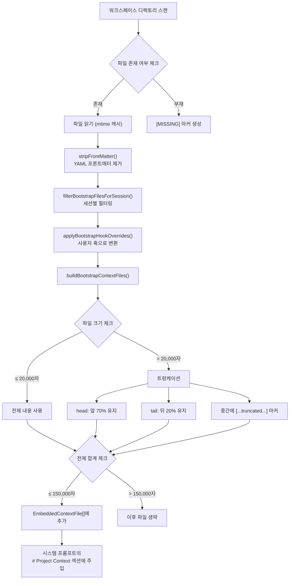

**부트스트랩 파일 우선순위 및 역할:**

| 파일명 | 역할 | 기본 위치 |
|--------|------|----------|
| `AGENTS.md` | 에이전트 지시사항 (CLAUDE.md와 동일) | `~/.openclaw/workspace/AGENTS.md` |
| `SOUL.md` | 에이전트 페르소나/톤 정의 | `~/.openclaw/workspace/SOUL.md` |
| `TOOLS.md` | 외부 도구 사용 가이드 | `~/.openclaw/workspace/TOOLS.md` |
| `IDENTITY.md` | 에이전트 정체성 설정 | `~/.openclaw/workspace/IDENTITY.md` |
| `USER.md` | 사용자 프로필 정보 | `~/.openclaw/workspace/USER.md` |
| `MEMORY.md` | 누적 메모리 (대화 간 유지) | `~/.openclaw/workspace/MEMORY.md` |
| `HEARTBEAT.md` | 하트비트 프롬프트 커스텀 | `~/.openclaw/workspace/HEARTBEAT.md` |
| `BOOTSTRAP.md` | 추가 부트스트랩 지시사항 | `~/.openclaw/workspace/BOOTSTRAP.md` |

**트렁케이션 전략:**
- 파일당 기본 최대 `20,000`자 (`DEFAULT_BOOTSTRAP_MAX_CHARS`)
- 전체 파일 합계 기본 최대 `150,000`자 (`DEFAULT_BOOTSTRAP_TOTAL_MAX_CHARS`)
- 초과 시: 앞 70% + `[...truncated...]` 마커 + 뒤 20% 보존
- 설정으로 변경 가능: `config.agents.defaults.bootstrapMaxChars` / `bootstrapTotalMaxChars`

#### 10. Silent Replies (무응답 처리)
```
## Silent Replies
When you have nothing to say, respond with ONLY: ⁂
⚠️ Rules:
- It must be your ENTIRE message — nothing else
- Never append it to an actual response
```

#### 11. Heartbeats (하트비트)
```
## Heartbeats
Heartbeat prompt: (configured)
If you receive a heartbeat poll, and there is nothing that needs attention, reply exactly:
HEARTBEAT_OK
```

#### 12. Runtime (런타임 정보)
```
## Runtime
Runtime: agent=default | host=macbook | os=darwin (arm64) | node=v22.x | model=claude-opus-4-6 | channel=telegram | thinking=off
Reasoning: off (hidden unless on/stream).
```

### 최종 시스템 프롬프트 예시 (축약)

```
You are a personal assistant running inside OpenClaw.

## Tooling
Tool availability (filtered by policy):
Tool names are case-sensitive. Call tools exactly as listed.
- read: Read file contents
- write: Create or overwrite files
- edit: Make precise edits to files
- exec: Run shell commands
- grep: Search file contents for patterns
- message: Send messages and channel actions
- cron: Manage cron jobs and wake events
- sessions_send: Send a message to another session
...

## Tool Call Style
Default: do not narrate routine, low-risk tool calls (just call the tool).
...

## Safety
You have no independent goals...
...

## Skills (mandatory)
Before replying: scan <available_skills>...
<available_skills>
  <skill><name>commit</name>...</skill>
  <skill><name>code-review</name>...</skill>
</available_skills>

## Memory Recall
Before answering anything about prior work...

## Workspace
Your working directory is: /Users/user/.openclaw/workspace

## Authorized Senders
Authorized senders: +821012345678.

## Reply Tags
[[reply_to_current]] replies to the triggering message.

## Messaging
- Reply in current session → automatically routes to the source channel
- Cross-session messaging → use sessions_send(...)
...

# Project Context
The following project context files have been loaded:

## AGENTS.md
(에이전트 지시사항 내용)

## SOUL.md
(페르소나 설정 내용)

## MEMORY.md
(누적 메모리 내용)

## Silent Replies
When you have nothing to say, respond with ONLY: ⁂

## Heartbeats
If you receive a heartbeat poll... reply exactly: HEARTBEAT_OK

## Runtime
Runtime: agent=default | host=macbook | model=claude-opus-4-6 | channel=telegram | thinking=off
```

### 프롬프트 구성 핵심 코드 참조

| 컴포넌트 | 파일 | 함수 |
|----------|------|------|
| **메인 프롬프트 조립** | `src/agents/system-prompt.ts:196` | `buildAgentSystemPrompt()` |
| **임베디드 래퍼** | `src/agents/pi-embedded-runner/system-prompt.ts:11` | `buildEmbeddedSystemPrompt()` |
| **세션 적용** | `src/agents/pi-embedded-runner/system-prompt.ts:91` | `applySystemPromptOverrideToSession()` |
| **부트스트랩 파일 해석** | `src/agents/bootstrap-files.ts:72` | `resolveBootstrapContextForRun()` |
| **컨텍스트 파일 빌드** | `src/agents/pi-embedded-helpers/bootstrap.ts:187` | `buildBootstrapContextFiles()` |
| **파일 트렁케이션** | `src/agents/pi-embedded-helpers/bootstrap.ts:114` | `trimBootstrapContent()` |
| **워크스페이스 파일 로드** | `src/agents/workspace.ts` | `loadWorkspaceBootstrapFiles()` |
| **훅 오버라이드** | `src/agents/bootstrap-hooks.ts` | `applyBootstrapHookOverrides()` |
| **런타임 파라미터** | `src/agents/system-prompt-params.ts:35` | `buildSystemPromptParams()` |
| **프롬프트 리포트** | `src/agents/system-prompt-report.ts:120` | `buildSystemPromptReport()` |

---

## 도구(Tool) 실행 파이프라인

### 도구 등록 흐름

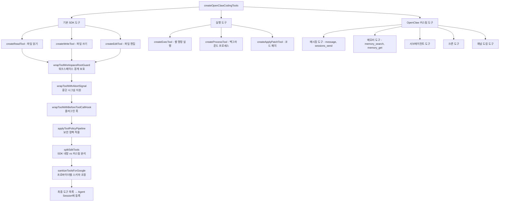

### 도구 실행 수명주기

```
1. LLM 응답에서 tool_use 블록 감지
   { "type": "tool_use", "name": "exec", "input": { "command": "ls -la" } }

2. SDK가 도구 레지스트리에서 해당 도구 검색

3. 도구 래퍼 체인 실행:
   AbortSignal 체크 → BeforeToolCallHook → PolicyPipeline → 실제 도구 실행

4. 도구 실행 결과 캡처:
   { "type": "tool_result", "content": "total 48\ndrwxr-xr-x..." }

5. 결과 후처리:
   - 결과 크기 초과 시 truncation (Context Guard)
   - 미디어 URL 추출
   - 중복 메시지 감지 (메시징 도구)

6. tool_result 메시지를 대화 히스토리에 추가

7. LLM에 다시 전달 → 다음 판단
```

---

## 세션 및 컨텍스트 관리

### 세션 저장 구조

```
~/.openclaw/
├── sessions/           # 세션 메타데이터
│   └── <sessionId>.json
├── agents/
│   └── <agentId>/
│       └── sessions/
│           └── <sessionId>.jsonl    # 대화 트랜스크립트 (JSONL)
└── credentials/        # 인증 정보
```

### 대화 히스토리 관리 흐름

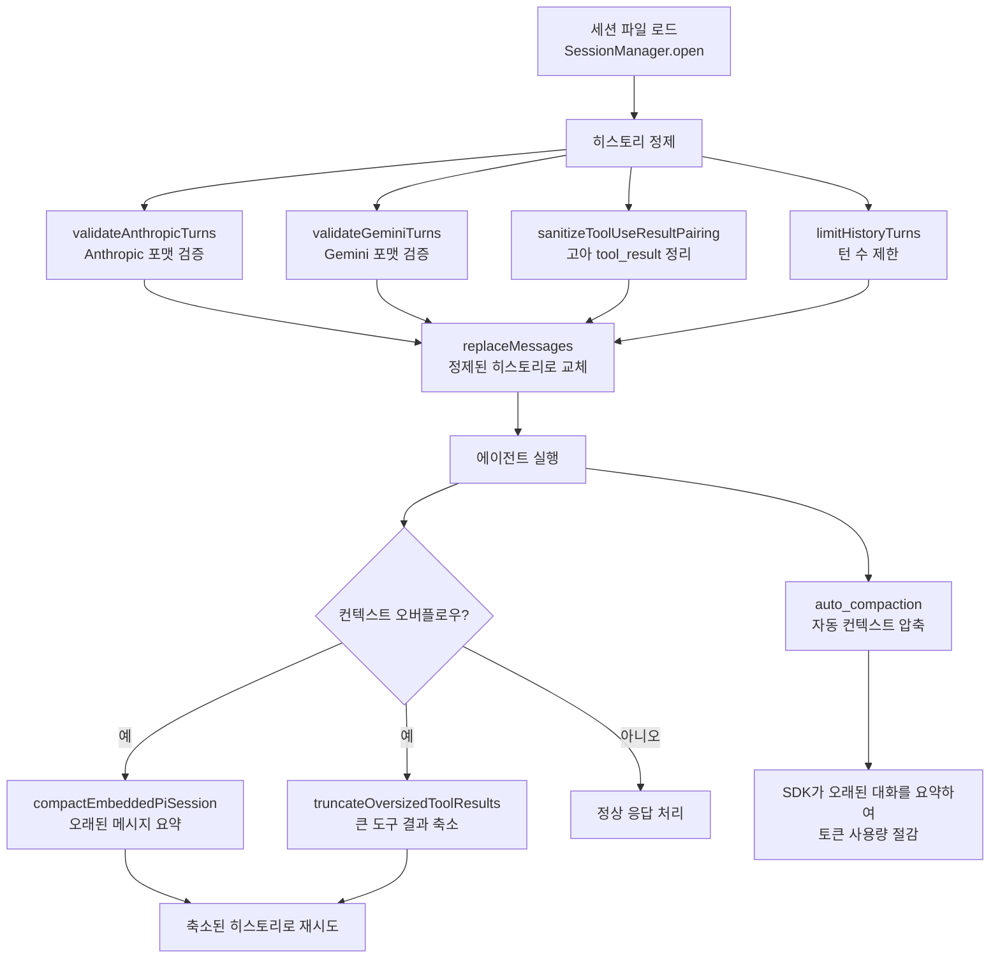

### 토큰 사용량 추적

```typescript
// 실행 중 누적되는 사용량 정보
{
  inputTokens: number,      // 입력 토큰
  outputTokens: number,     // 출력 토큰
  cacheReadTokens: number,  // 캐시 읽기 토큰
  cacheWriteTokens: number  // 캐시 쓰기 토큰
}
```

---

## 에러 처리 및 Failover

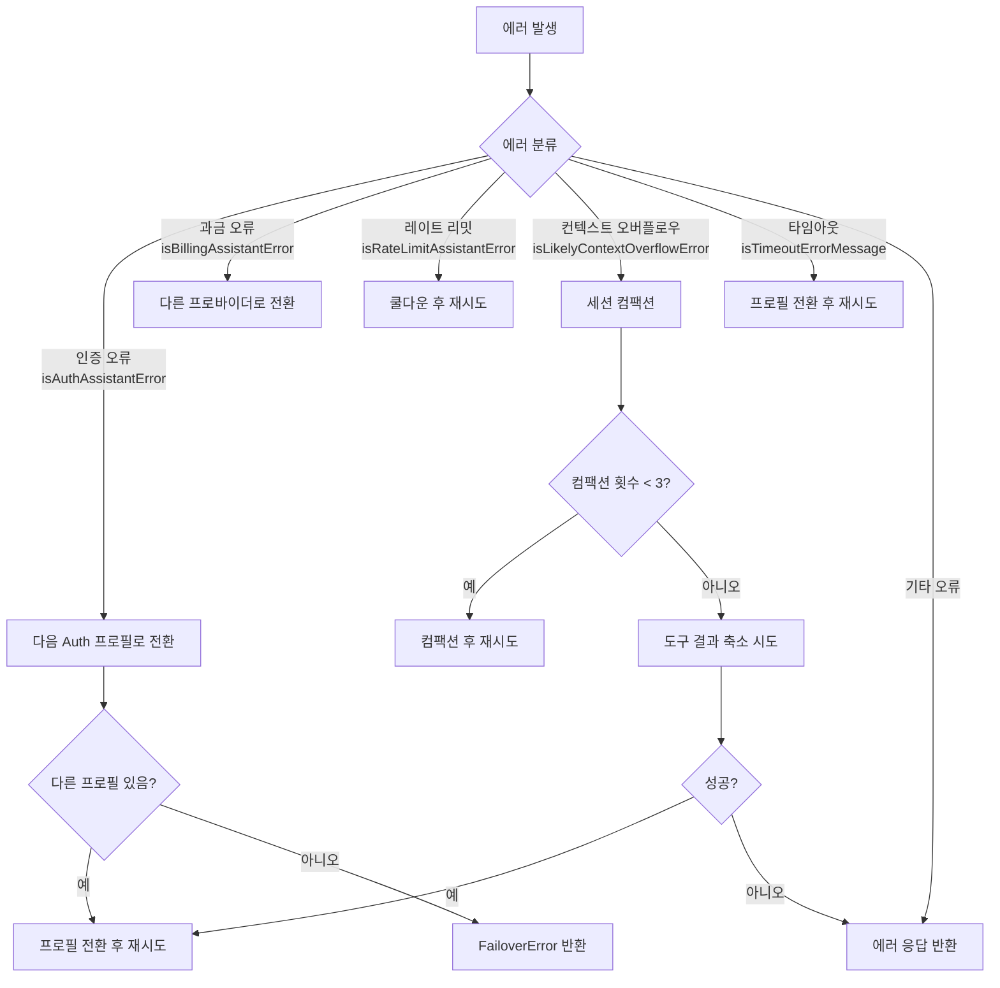

**에러 분류 함수 (`pi-embedded-helpers.ts`):**
| 함수 | 감지 대상 |
|------|----------|
| `isAuthAssistantError()` | API 키/인증 실패 |
| `isBillingAssistantError()` | 과금 한도 초과 |
| `isRateLimitAssistantError()` | 요청 빈도 제한 |
| `isLikelyContextOverflowError()` | 컨텍스트 윈도우 초과 |
| `isTimeoutErrorMessage()` | 응답 타임아웃 |
| `isFailoverAssistantError()` | 복구 가능한 일반 오류 |

---

## 핵심 파일 참조

| 컴포넌트 | 파일 경로 | 핵심 함수 |
|----------|----------|----------|
| **CLI 진입점** | `src/entry.ts` | `main()` |
| **CLI 라우터** | `src/cli/run-main.ts` | `runCli()` |
| **프로그램 빌더** | `src/cli/program/build-program.ts` | `buildProgram()` |
| **에이전트 명령 (게이트웨이)** | `src/commands/agent-via-gateway.ts` | `agentViaGatewayCommand()` |
| **에이전트 명령 (로컬)** | `src/commands/agent.ts` | `agentCommand()` |
| **게이트웨이 에이전트 핸들러** | `src/gateway/server-methods/agent.ts` | `agentHandlers.agent()` |
| **임베디드 Pi 러너** | `src/agents/pi-embedded-runner/run.ts` | `runEmbeddedPiAgent()` |
| **실행 시도** | `src/agents/pi-embedded-runner/run/attempt.ts` | `runEmbeddedAttempt()` |
| **시스템 프롬프트** | `src/agents/system-prompt.ts` | `buildAgentSystemPrompt()` |
| **도구 생성** | `src/agents/pi-tools.ts` | `createOpenClawCodingTools()` |
| **모델 해석** | `src/agents/pi-embedded-runner/model.ts` | `resolveModel()` |
| **스트리밍 구독** | `src/agents/pi-embedded-subscribe.ts` | `subscribeEmbeddedPiSession()` |
| **이벤트 핸들러** | `src/agents/pi-embedded-subscribe.handlers.ts` | `createEmbeddedPiSessionEventHandler()` |
| **메시지 핸들러** | `src/agents/pi-embedded-subscribe.handlers.messages.ts` | `handleMessage*()` |
| **도구 핸들러** | `src/agents/pi-embedded-subscribe.handlers.tools.ts` | `handleToolExecution*()` |
| **세션 컴팩션** | `src/agents/pi-embedded-runner/compact.ts` | `compactEmbeddedPiSessionDirect()` |
| **히스토리 관리** | `src/agents/pi-embedded-runner/history.ts` | `limitHistoryTurns()` |
| **응답 페이로드** | `src/agents/pi-embedded-runner/run/payloads.ts` | `buildEmbeddedRunPayloads()` |
| **이미지 처리** | `src/agents/pi-embedded-runner/run/images.ts` | `detectAndLoadPromptImages()` |
| **응답 전달** | `src/commands/agent/delivery.ts` | `deliverAgentCommandResult()` |
| **아웃바운드 전달** | `src/infra/outbound/deliver.ts` | `deliverOutboundPayloads()` |
| **텔레그램 디스패치** | `src/telegram/bot-message-dispatch.ts` | `dispatchTelegramMessage()` |
| **게이트웨이 채팅** | `src/gateway/server-chat.ts` | `createChatRunRegistry()` |

---

## 요약: 쿼리 한 건의 여정

```
사용자 "파일 목록 보여줘" 입력
  ↓
[1] CLI/Channel → Gateway HTTP 서버 도착
  ↓
[2] RPC 라우팅 → agent 핸들러 → 검증/중복제거/세션해석
  ↓
[3] 즉시 "accepted" 응답 → 백그라운드 에이전트 실행 시작
  ↓
[4] 세션 히스토리 로드 → 시스템 프롬프트 구성 → 도구 등록
  ↓
[5] LLM API 호출 (시스템프롬프트 + 대화기록 + 도구정의 + 사용자메시지)
  ↓
[6] LLM 응답: "파일 목록을 확인하겠습니다" + tool_use(exec: "ls -la")
  ↓
[7] exec 도구 실행 → "total 48\ndrwxr-xr-x  5 user ..."
  ↓
[8] tool_result를 대화에 추가 → LLM 재호출
  ↓
[9] LLM 최종 응답: "현재 디렉토리의 파일 목록입니다:\n..."
  ↓
[10] 응답 페이로드 조합 → 채널별 포맷 변환 → 전송
  ↓
사용자에게 최종 응답 도달
```
