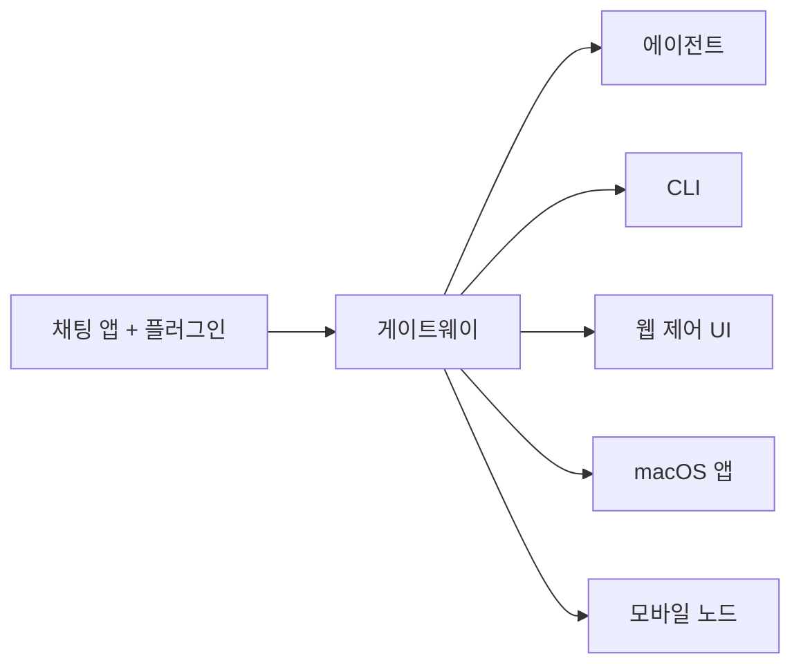

# OpenClaw 🦞

<p align="center">
    
    
</p>

> _"EXFOLIATE! EXFOLIATE!"_ — 아마도 어느 우주 가재가 한 말

<p align="center">
  <strong>WhatsApp, Telegram, Discord, iMessage 등을 지원하는 AI 에이전트용 통합 게이트웨이</strong><br />
  메시지를 보내면 주머니 속의 AI 에이전트가 답변합니다. 플러그인을 통해 더 많은 채널을 추가할 수 있습니다.
</p>

<Columns>
  <Card title="시작하기" href="/start/getting-started" icon="rocket">
    OpenClaw를 설치하고 몇 분 만에 게이트웨이를 구동하세요.
  </Card>
  <Card title="설정 위자드 실행" href="/start/wizard" icon="sparkles">
    `openclaw onboard` 명령어를 통해 안내에 따라 설정을 완료하세요.
  </Card>
  <Card title="제어 UI 열기" href="/web/control-ui" icon="layout-dashboard">
    채팅, 설정, 세션 관리를 위한 브라우저 대시보드를 엽니다.
  </Card>
</Columns>

## OpenClaw란 무엇인가요?

OpenClaw는 여러분이 즐겨 사용하는 채팅 앱(WhatsApp, Telegram, Discord, iMessage 등)을 AI 에이전트(Pi 등)와 연결해주는 **자체 호스팅(Self-hosted) 게이트웨이**입니다. 자신의 컴퓨터나 서버에서 게이트웨이 프로세스 하나만 실행하면, 메시징 앱과 언제어디서나 대화할 수 있는 AI 비서 사이의 다리 역할을 하게 됩니다.

**누구에게 필요한가요?** 데이터 제어권을 포기하거나 외부 서비스에 의존하지 않고, 어디서나 메시지를 통해 접근할 수 있는 개인용 AI 비서를 원하는 개발자와 파워 유저들을 위한 도구입니다.

**무엇이 다른가요?**
- **자체 호스팅**: 내 하드웨어에서 내 규칙대로 실행됩니다.
- **멀티 채널**: 게이트웨이 하나로 WhatsApp, Telegram, Discord 등을 동시에 지원합니다.
- **에이전트 특화**: 도구 사용, 세션, 메모리, 멀티 에이전트 라우팅 등 코딩 에이전트에 최적화되어 있습니다.
- **오픈 소스**: MIT 라이선스이며 커뮤니티 중심으로 운영됩니다.

---

## 작동 원리



게이트웨이는 세션, 라우팅, 채널 연결에 대한 **단일 신뢰 원천(Single source of truth)** 역할을 합니다.

---

## 5분 안에 시작하기

<Steps>
  <Step title="OpenClaw 설치">
    ```bash
    npm install -g openclaw@latest
    ```
  </Step>
  <Step title="설정 및 서비스 등록">
    ```bash
    openclaw onboard --install-daemon
    ```
  </Step>
  <Step title="메신저 로그인 및 실행">
    ```bash
    openclaw channels login
    openclaw gateway --port 18789
    ```
  </Step>
</Steps>

상세한 설치 및 개발 환경 구축 방법은 [빠른 시작 가이드](/start/quickstart)를 참고하세요.

---

## 대시보드

게이트웨이가 시작되면 브라우저에서 제어 UI를 열 수 있습니다.
- 로컬 접속: [http://127.0.0.1:18789/](http://127.0.0.1:18789/)
- 원격 접속 안내: [웹 인터페이스](/web) 및 [Tailscale 사용법](/gateway/tailscale)

---

## 더 알아보기

<Columns>
  <Card title="기능 전체 목록" href="/concepts/features" icon="list">
    지원 채널, 라우팅, 미디어 처리 등 모든 기능을 확인하세요.
  </Card>
  <Card title="설정 가이드" href="/gateway/configuration" icon="settings">
    게이트웨이 설정, 토큰, API 제공자 구성 방법을 배웁니다.
  </Card>
  <Card title="보안" href="/gateway/security" icon="shield">
    토큰, 허용 목록, 안전 제어 장치에 대해 알아봅니다.
  </Card>
  <Card title="트러블슈팅" href="/gateway/troubleshooting" icon="wrench">
    진단 도구 사용법과 일반적인 오류 해결 방법을 확인하세요.
  </Card>
</Columns>
---
