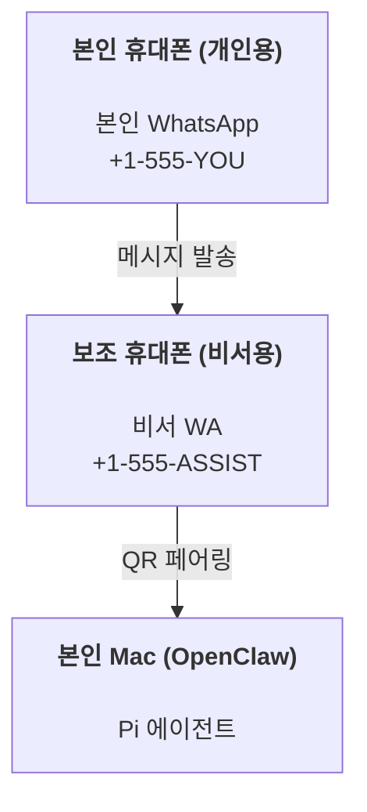

# OpenClaw로 개인용 비서 구축하기

OpenClaw는 **Pi** 에이전트를 위한 WhatsApp, Telegram, Discord, iMessage 게이트웨이입니다. 플러그인을 통해 Mattermost도 추가할 수 있습니다. 이 가이드는 항상 켜져 있는 에이전트처럼 작동하는 전용 WhatsApp 번호를 사용하는 "개인용 비서" 설정 방법을 다룹니다.

## ⚠️ 안전이 최우선입니다

에이전트는 다음과 같은 권한을 갖게 됩니다:

- 여러분의 머신에서 명령 실행 (Pi 도구 설정에 따라 다름)
- 워크스페이스 내 파일 읽기/쓰기
- WhatsApp, Telegram, Discord, Mattermost(플러그인)를 통해 외부로 메시지 전송

처음에는 보수적으로 시작하세요:

- 항상 `channels.whatsapp.allowFrom`을 설정하세요 (개인용 Mac에서 외부로 열린 채로 실행하지 마세요).
- 비서 전용 WhatsApp 번호를 사용하세요.
- 하트비트는 기본적으로 30분마다 실행됩니다. 설정을 신뢰할 수 있을 때까지 `agents.defaults.heartbeat.every: "0m"`으로 설정하여 비활성화하세요.

## 요구 사항

- OpenClaw 설치 및 온보딩 완료 — 아직 하지 않았다면 [시작하기](/start/getting-started)를 참고하세요.
- 비서용 보조 전화번호 (SIM/eSIM/선불폰 등)

## 투폰 설정 (권장)

다음과 같은 구조를 권장합니다:



본인의 개인 WhatsApp을 OpenClaw에 연결하면, 본인에게 오는 모든 메시지가 "에이전트 입력"이 되어 버립니다. 이는 일반적으로 원하는 방식이 아닐 것입니다.

## 5분 빠른 시작

1. WhatsApp Web 페어링 (QR 코드가 표시되면 비서용 폰으로 스캔하세요):

```bash
openclaw channels login
```

2. 게이트웨이 시작 (종료하지 말고 계속 실행해 두세요):

```bash
openclaw gateway --port 18789
```

3. `~/.openclaw/openclaw.json`에 최소한의 설정을 추가합니다:

```json5
{
  channels: { whatsapp: { allowFrom: ["+15555550123"] } },
}
```

이제 허용 목록에 등록된 폰으로 비서 번호에 메시지를 보내보세요.

온보딩이 완료되면 자동으로 대시보드가 열리고 깨끗한(토큰이 포함되지 않은) 링크가 출력됩니다. 인증을 요청받으면 `gateway.auth.token`의 토큰을 제어 UI 설정에 붙여넣으세요. 나중에 다시 열려면 `openclaw dashboard`를 실행하세요.

## 에이전트 워크스페이스 (AGENTS) 부여하기

OpenClaw는 워크스페이스 디렉토리에서 운영 지침과 "메모리"를 읽어옵니다.

기본적으로 `~/.openclaw/workspace`를 사용하며, 설정 또는 에이전트 첫 실행 시 필요한 파일들(`AGENTS.md`, `SOUL.md`, `TOOLS.md`, `IDENTITY.md`, `USER.md`, `HEARTBEAT.md`)을 자동으로 생성합니다. `BOOTSTRAP.md`는 워크스페이스가 완전히 새로 만들어질 때만 생성됩니다(한 번 삭제하면 다시 나타나지 않아야 합니다). `MEMORY.md`는 선택 사항이며 자동으로 생성되지 않지만, 존재하면 일반 세션에서 로드됩니다. 서브 에이전트 세션은 `AGENTS.md`와 `TOOLS.md`만 주입합니다.

팁: 이 폴더를 OpenClaw의 "기억 장치"로 취급하고 Git 레포지토리(가급적 비공개)로 만들어 `AGENTS.md`와 메모리 파일들을 백업하세요. Git이 설치되어 있다면 새로운 워크스페이스는 자동으로 초기화됩니다.

```bash
openclaw setup
```

전체 워크스페이스 구조 및 백업 가이드: [에이전트 워크스페이스](/concepts/agent-workspace)
메모리 워크플로: [메모리](/concepts/memory)

선택 사항: `agents.defaults.workspace` 설정을 통해 다른 워크스페이스 경로를 선택할 수 있습니다 (`~` 지원).

```json5
{
  agent: {
    workspace: "~/.openclaw/workspace",
  },
}
```

이미 자신만의 워크스페이스 파일들을 별도의 레포지토리에서 관리하고 있다면, 자동 부트스트랩 파일 생성을 비활성화할 수 있습니다:

```json5
{
  agent: {
    skipBootstrap: true,
  },
}
```

## 에이전트 설정을 비서답게 바꾸기

OpenClaw의 기본값은 비서 업무에 적합하게 설정되어 있지만, 일반적으로 다음과 같은 사항들을 조정하고 싶을 것입니다:

- `SOUL.md`의 페르소나/지침
- 사고(thinking) 모드 기본값
- 하트비트 (설정을 신뢰하게 된 이후)

예시:

```json5
{
  logging: { level: "info" },
  agent: {
    model: "anthropic/claude-opus-4-6",
    workspace: "~/.openclaw/workspace",
    thinkingDefault: "high",
    timeoutSeconds: 1800,
    // 0으로 시작한 뒤 나중에 활성화하세요.
    heartbeat: { every: "0m" },
  },
  channels: {
    whatsapp: {
      allowFrom: ["+15555550123"],
      groups: {
        "*": { requireMention: true },
      },
    },
  },
  routing: {
    groupChat: {
      mentionPatterns: ["@openclaw", "openclaw"],
    },
  },
  session: {
    scope: "per-sender",
    resetTriggers: ["/new", "/reset"],
    reset: {
      mode: "daily",
      atHour: 4,
      idleMinutes: 10080,
    },
  },
}
```

## 세션 및 메모리

- 세션 파일: `~/.openclaw/agents/<agentId>/sessions/{{SessionId}}.jsonl`
- 세션 메타데이터(토큰 사용량, 마지막 경로 등): `~/.openclaw/agents/<agentId>/sessions/sessions.json` (레거시: `~/.openclaw/sessions/sessions.json`)
- `/new` 또는 `/reset` 명령은 해당 채팅에 대해 새로운 세션을 시작합니다 (`resetTriggers`로 설정 가능). 단독으로 보냈을 경우 에이전트는 리셋을 확인하는 짧은 인사를 보냅니다.
- `/compact [지침]` 명령은 세션 컨텍스트를 압축하고 남은 컨텍스트 예산을 보고합니다.

## 하트비트 (능동 모드)

기본적으로 OpenClaw는 30분마다 하트비트를 실행하며 다음 프롬프트를 보냅니다:
`HEARTBEAT.md 파일이 존재하면 읽으세요(워크스페이스 컨텍스트). 이를 엄격히 따르세요. 이전 채팅의 오래된 내용을 추측하거나 반복하지 마세요. 주의를 기울여야 할 일이 없다면 HEARTBEAT_OK라고 답변하세요.`
비활성화하려면 `agents.defaults.heartbeat.every: "0m"`으로 설정하세요.

- `HEARTBEAT.md` 파일이 존재하지만 내용이 비어 있거나(빈 줄이나 `# 제목` 같은 헤더만 있는 경우), OpenClaw는 API 호출을 아끼기 위해 하트비트 실행을 건너뜁니다.
- 파일이 없어도 하트비트는 실행되며 모델이 무엇을 할지 결정합니다.
- 에이전트가 `HEARTBEAT_OK` (또는 지정된 글자 수 이하의 짧은 응답; `agents.defaults.heartbeat.ackMaxChars` 참고)라고 답변하면 OpenClaw는 해당 하트비트 메시지를 외부로 전송하지 않습니다.
- 하트비트는 완전한 에이전트 턴(turn)을 실행하므로 주기가 짧을수록 토큰 소모가 커집니다.

```json5
{
  agent: {
    heartbeat: { every: "30m" },
  },
}
```

## 미디어 주고받기

수신된 첨부 파일(이미지/오디오/문서)은 템플릿을 통해 명령에 노출될 수 있습니다:

- `{{MediaPath}}` (로컬 임시 파일 경로)
- `{{MediaUrl}}` (가상 URL)
- `{{Transcript}}` (오디오 전사 기능 활성화 시)

에이전트가 외부로 첨부 파일을 보낼 때는 별도의 줄에 `MEDIA:<경로-또는-URL>` 형식을 사용합니다(공백 포함 안 됨). 예시:

```
스크린샷입니다.
MEDIA:https://example.com/screenshot.png
```

OpenClaw는 이 부분을 추출하여 텍스트와 함께 미디어로 전송합니다.

## 운영 체크리스트

```bash
openclaw status          # 로컬 상태 (인증 정보, 세션, 대기 이벤트)
openclaw status --all    # 전체 진단 (읽기 전용, 붙여넣기 가능)
openclaw status --deep   # 게이트웨이 헬스 체크 추가 (Telegram + Discord)
openclaw health --json   # 게이트웨이 헬스 스냅샷 (WS)
```

로그는 `/tmp/openclaw/` 아래에 저장됩니다 (기본값: `openclaw-YYYY-MM-DD.log`).

## 다음 단계

- 웹채팅 (WebChat): [웹채팅](/web/webchat)
- 게이트웨이 운영: [게이트웨이 운영 가이드](/gateway)
- 크론 및 웨이크업: [크론 작업](/automation/cron-jobs)
- macOS 메뉴 바 앱: [OpenClaw macOS 앱](/platforms/macos)
- iOS 노드 앱: [iOS 앱](/platforms/ios)
- Android 노드 앱: [Android 앱](/platforms/android)
- Windows 상태: [Windows (WSL2)](/platforms/windows)
- Linux 상태: [Linux 앱](/platforms/linux)
- 보안: [보안](/gateway/security)
