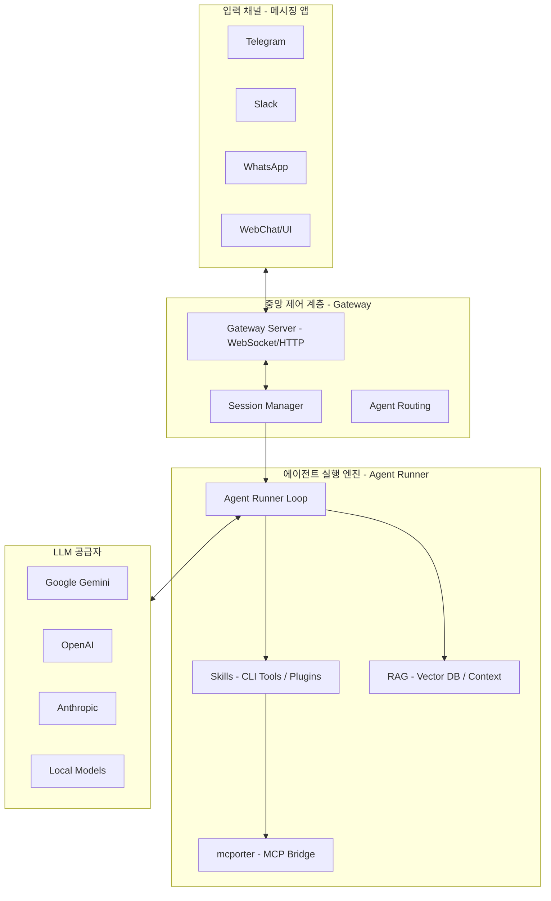
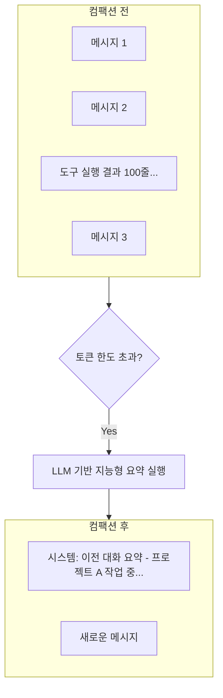
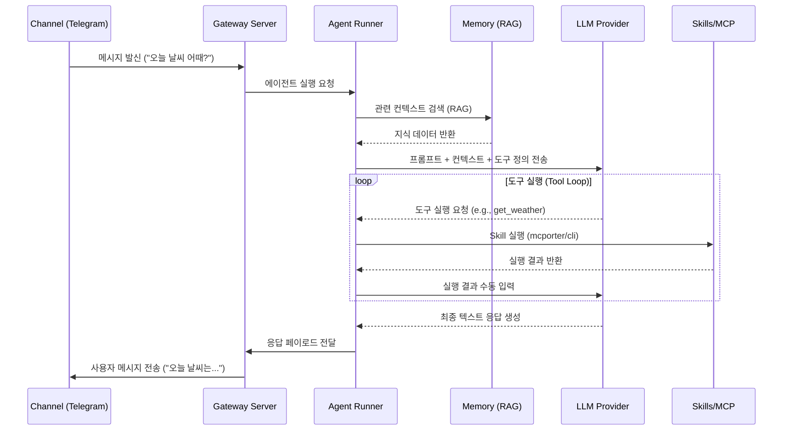

# OpenClaw 아키텍처 및 동작 원리 상세 가이드

이 문서는 OpenClaw 프로젝트의 소스 코드 분석을 바탕으로, 시스템이 어떻게 프롬프트를 처리하고 도구와 연동하며 지식을 관리하는지 상세히 설명합니다.

---

## 1. 전반적인 아키텍처 개요

OpenClaw는 **개인용 AI 어시스턴트 게이트웨이**입니다. 다양한 메시징 채널(WhatsApp, Telegram, Slack 등)과 AI 모델 사이에서 라우팅, 세션 관리, 도구 실행을 담당하는 중앙 허브 역할을 합니다.

---

## 2. 메시지 처리 흐름 (Request Flow)

사용자가 메시지를 보냈을 때 워크플로우는 다음과 같습니다.

1.  **채널 수신**: Telegram/Slack 채널 플러그인이 메시지를 받아 `Gateway`로 전달합니다.
2.  **세션 식별**: 메시지의 발신자 및 스레드 정보를 바탕으로 기존 세션을 찾거나 새로 생성합니다.
3.  **에이전트 실행 (`agent-runner.ts`)**: `runReplyAgent` 함수가 호출되어 에이전트의 한 턴(Turn)을 시작합니다.
4.  **컨텍스트 준비**: 대화 기록, RAG 지식, 시스템 프롬프트를 조합하여 LLM에 보낼 페이로드를 만듭니다.
5.  **LLM 추론 및 도구 호출**:
    *   LLM이 도구 사용이 필요하다고 판단하면 해당 `Skill`을 호출합니다.
    *   **MCP 연동**: MCP(Model Context Protocol) 도구가 필요한 경우 `mcporter` CLI를 통해 외부 MCP 서버와 통신합니다.
6.  **결과 반환**: 최종 응답이 생성되면 다시 채널을 통해 사용자에게 메시지가 전달됩니다.

---

## 3. 핵심 기술 요소 설명

### 3.1 RAG (Retrieval-Augmented Generation)
OpenClaw는 `src/memory` 폴더에 구현된 매우 정교한 RAG 시스템을 내장하고 있습니다.
*   **Vector DB**: SQLite(`sqlite-vec`)를 사용하여 로컬에 임베딩 데이터를 저장합니다.
*   **검색 전략**: 단순 검색을 넘어 **MMR(최대 한계 관련성)**, **Temporal Decay(시간 경과에 따른 가산점)**, **Query Expansion(쿼리 확장)** 등을 지원합니다.
*   **임베딩**: Gemini, OpenAI, Mistral 등 다양한 공급자의 임베딩 모델을 활용할 수 있습니다.

### 3.2 지능형 컴팩션 (Intelligent Compaction)
긴 대화로 인해 토큰 제한(Context Window)을 넘지 않도록 하는 OpenClaw만의 독특한 자가 관리 메커니즘입니다. 단순한 과거 기록 삭제가 아니라, AI가 자신의 기억을 요약하여 부피를 줄이는 과정입니다.

#### 컴팩션 동작 단계
1.  **감지 (Detection)**: 전체 토큰 사용량이 설정된 임계치(보통 80~90%)에 도달하면 `compactEmbeddedPiSession`이 호출됩니다.
2.  **정제 (Sanitization)**: 불필요한 공백, 중복된 도구 실행 로그 등을 우선 정리합니다.
3.  **자가 요약 (Self-Summarization)**: LLM을 별도로 호출하여 현재까지의 대화 맥락 중 미래에 필요한 핵심 정보(의도, 결정 사항, 상태)만을 추출하여 요약본을 생성합니다.
4.  **기록 교체 (Replacement)**: 기존의 수많은 메시지 블록을 삭제하고, 이를 하나의 '이전 대화 요약' 시스템 메시지로 대체하여 컨텍스트 공간을 즉시 확보합니다.

#### 컴팩션 워크플로우

### 3.3 도구와 스킬 (Skills)
OpenClaw의 모든 기능은 `Skills`라는 단위로 확장됩니다.
*   **Core Tools**: 브라우저 조작, 파일 읽기/쓰기, 터미널 실행 등은 내장된 핵심 도구입니다.
*   **MCP (Model Context Protocol)**: `mcporter`라는 브릿지 도구를 사용하여 수천 개의 외부 MCP 도구와 연결됩니다.
*   **플러그인 구조**: 사용자가 새로운 CLI 도구를 설치하고 `Skills` 설정을 통해 에이전트에게 기능을 부여할 수 있습니다.

---

## 4. 프롬프트 실행 루프 상세 (Mermaid)

---

## 5. 결론: RAG인가 LangGraph인가?

*   **RAG 사용 여부**: **YES**. 매우 수준 높은 자체 RAG 구현체를 가지고 있습니다.
*   **LangGraph 사용 여부**: **NO**. LangGraph 같은 외부 프레임워크 대신, 프로젝트 특성에 최적화된 **자체 에이전트 루프(Agentic Loop)**를 `src/auto-reply/reply/` 디렉토리 아래에 직접 구현하여 사용합니다.
*   **핵심 철학**: "Local-first" 및 "Extensibility". 사용자의 로컬 환경에서 모든 데이터(세션, 벡터 DB)를 관리하며, CLI 도구와 MCP를 통해 무한한 확장성을 제공하는 것이 아키텍처의 핵심입니다.

---

*본 문서는 소스 코드 분석 결과를 바탕으로 Antigravity 에이전트에 의해 작성되었습니다.*
